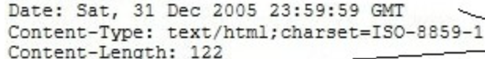

## 简介
HTTP协议是 Hyper Text Transfer Protocol（超文本传输协议）的缩写
HTTP是一个基于TCP/IP通信协议来传递数据
有三个特点：
1. 无连接，一次处理一个请求，处理完断开
2. 类型无关，可以传任意类型数据
3. 无状态，没有记忆功能

## 请求

请求行 
请求头 
请求数据 

## 响应

状态行 HTTP/1.1 200 OK  
消息报头   

消息正文

## Status Code

| 错误码 | 说明       |
|--------|----------|
| 1xx    | 相关信息   |
| 2xx    | 操作成功   |
| 3xx    | 重定向     |
| 4xx    | 客户端错误 |
| 5xx    | 服务器错误 |

## 请求方法

> HTTP1.0 定义了三种请求方法： GET, POST 和 HEAD方法。  
> HTTP1.1 新增了五种请求方法：OPTIONS、PUT、PATCH、DELETE、TRACE 和 CONNECT 方法。

| 方法    | 描述                                                                                                                                |
|---------|-----------------------------------------------------------------------------------------------------------------------------------|
| GET     | 请求指定的页面信息，并返回实体主体。                                                                                                  |
| HEAD    | 类似于 GET 请求，只不过返回的响应中没有具体的内容，用于获取报头                                                                       |
| POST    | 向指定资源提交数据进行处理请求（例如提交表单或者上传文件）。数据被包含在请求体中。POST 请求可能会导致新的资源的建立和/或已有资源的修改。 |
| PUT     | 从客户端向服务器传送的数据取代指定的文档的内容。                                                                                     |
| DELETE  | 请求服务器删除指定的页面。                                                                                                           |
| CONNECT | HTTP/1.1 协议中预留给能够将连接改为管道方式的代理服务器。                                                                            |
| OPTIONS | 允许客户端查看服务器的性能。                                                                                                         |
| TRACE   | 回显服务器收到的请求，主要用于测试或诊断。                                                                                            |
| PATCH   | 是对 PUT 方法的补充，用来对已知资源进行局部更新 。                                                                                    |

## 引用

1. [RESTful API 最佳实践](http://www.ruanyifeng.com/blog/2018/10/restful-api-best-practices.html)   
2. [HTTP 请求方法 | 菜鸟教程](https://www.runoob.com/http/http-methods.html)   
3. [错误码查询](https://httpstatuses.com)