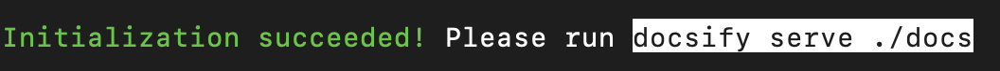
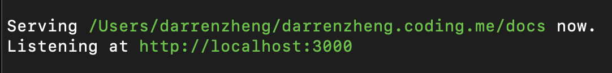

# Docsify

## 资料

[官网文档](https://docsify.js.org)  
[Github Repo](https://github.com/docsifyjs/docsify-cli)

## 安装

依赖 node

``` bash
brew install node
```

依赖 npm

``` bash
brew install npm 
```

安装 docsify

``` bash
npm i docsify-cli -g
```

项目初始化

```  bash
docsify init ./docs --local --theme dark
```



开启本地调试

```
docsify serve docs 
```



使用不同的 host

``` shell
docsify serve --port 4000 
```

``` shell
cd docs && python -m SimpleHTTPServer 3000
```

> 注: Safari 如果打不开 localhost，用 Chrome 打开

## 导航栏和侧边栏

docs 文件夹添加 `_navbar.md` 和 `_sidebar.md`
修改 `index.html` 以激活侧边栏和导航栏

``` html
  <script>
    window.$docsify = {
      name: '',
      repo: '',
      loadSidebar: true,
      subMaxLevel: 2,
      search: 'auto',
      loadNavbar: true,
      // coverpage: true,
      // auto2top: true,
      autoHeader: true
    }
  </script>
```

## 改变页面风格

[themeable](https://jhildenbiddle.github.io/docsify-themeable/#/themes)三套风格可以换
```
  <!-- <link rel="stylesheet" href="https://cdn.jsdelivr.net/npm/docsify-themeable@0/dist/css/theme-defaults.css"> -->
  <!-- <link rel="stylesheet" href="https://cdn.jsdelivr.net/npm/docsify-themeable@0/dist/css/theme-simple.css"> -->
  <link rel="stylesheet" href="https://cdn.jsdelivr.net/npm/docsify-themeable@0/dist/css/theme-simple-dark.css">
```

先要安装 themeable

``` html
  <script src="https://cdn.jsdelivr.net/npm/docsify-themeable@0"></script>
```

## 补充代码高亮

docsify 只提供了基本的代码高亮

到 github 上选择自己需要新增的高亮
https://github.com/PrismJS/prism/tree/gh-pages/components

像这样

``` html
<script src="//unpkg.com/prismjs/components/prism-php.min.js"></script>
```

追加到
``` html
<script src="//unpkg.com/docsify/lib/docsify.min.js"></script>
```
后面

