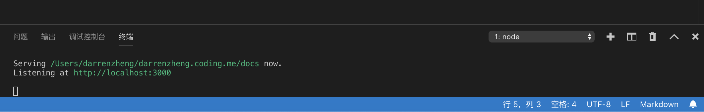

# VSCode

## 快捷键

- **Spotlight** 让出 `CTRL + SPACE` 的代码补全
- **Debug Mode**: `F5` 改为 `CMD + R`
- **Stop Debug Mode**: `SHIFT + F5` 改为 `SHIFT + CMD + R`
- **Hot Reload**: `CTRL + F5` 改为 `CTRL + CMD + R`

- CMD + K, W: 关闭所有标签
- ALT + `: quick fix
- CTRL + M, CTRL + C：Markdown code block

## 设置

- 勾选 `Preview Flutter Ui Guides`
- 不每次 debug 都进入调试窗口 `Debug: Open Debug` 改为 `NeverOpen`
- 开启自动换行 `editor.wordWrap` , `Editor: Word Wrap Column` 改为 1

## 技巧

cmd + shift + ` 开启 vscode 内的 terminal，可以调试个站